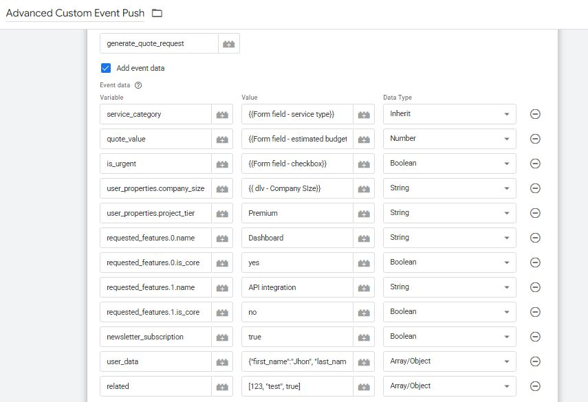
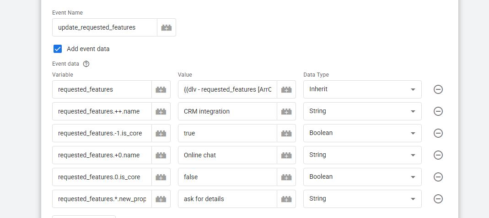

# GTM Advanced Custom Event Push

A GTM template that pushes custom events and structured data by dynamically constructing dataLayer objects, offering explicit control over data types and nesting via dot notation.

---
## Features

-   **Flexible Event & Data Pushing**: Easily configure and push any event along with a custom set of structured data parameters.
-   **Data Type Handling**: Specify whether your data is a `String`, `Number`, or `Boolean` or use "Inherit" to preserve the original type from the data source.
-   **Dot Notation Support**: Create complex nested objects and arrays directly from the UI by using dot notation in parameter names (e.g., `ecommerce.items.0.item_name`).

---
### ## Advanced Array Manipulation

Beyond standard numeric indexing (e.g., `requested_features.0`), the 'Variable' field supports special operators dynamic array manipulation.

| Operator | Name | Use Case | Description | Examples |
| :--- | :--- | :--- | :--- | :--- |
| `++` | Append / Push | **Direct Value** **Object Property** | Appends a value directly to the end of an array, or appends a new object and sets a property on it. | `related_docs_ids.++` `requested_features.++.name` |
| `+0` | Prepend / Unshift | **Direct Value** **Object Property** | Prepends a value directly to the beginning of an array, or prepends a new object and sets a property on it. | `related_docs_ids.+0` `requested_features.+0.name` |
| `-1` | Last Element | **Object Property** | Selects the last element of an array to modify one of its properties. **Must be followed by a property path.** | `requested_features.-1.priority` |
| `*` | Wildcard / For-Each | **Object Property** | Applies a modification to all elements in an array. **Must be followed by a property path.** | `requested_features.*.status` |

---
## Advaced Settings
-   **Custom Data Layer Support**: Works with GTM that use a custom name for the `dataLayer` variable.
-   **Conditional Debug Mode**: Enable detailed console logs for easy troubleshooting.

---
## How to Install

1.  Download the `template.tpl` file from this repository.
2.  Go to your Google Tag Manager container.
3.  Navigate to the **Templates** section and click **New** under "Tag Templates".
4.  Click the three dots menu (⋮) in the top right corner and select **Import**.
5.  Choose the `template.tpl` file you downloaded and save the template.

---
## Configuration

-   **Event Name**: The name of the event to push to the dataLayer (e.g., `click_and_scroll`).
-   **Add Event Data**: Check this box to add custom parameters to the event.
    -   **Event Parameters Table**:
        -   **Variable**: The key for your data point. Dot notation is supported (e.g., `ecommerce.value`, `ecommerce.items.0.price`).
        -   **Value**: The value for your data point. You can type a static value or insert a GTM Variable.
        -   **Data Type**: Specify the data type for the value.
            -   **Inherit from Variable**: (Default) preserve the original type from the data source. This is the recommended option if you don't need type conversion.
            -   **String** : Converts any input value into a text string. For example, the number 123 will become the string "123".
            -   **Number** : Converts the input into a numeric format (floating-point). Handles different decimal and thousands separators, automatically converting values like "1,234.56" (US format) or "1.234,56" (EU format) into the standard numeric value 1234.56 .
            -   **Boolean**: Coerces various string and numeric representations into a strict boolean true/false (True/False, 1/0, yes/no, granted/denied, on/off, accepted/rejected). The coercion logic is case-insensitive.
-   **Advanced Settings**
    -   **Use a custom Data Layer name**: Enable this if your website's Data Layer variable is not named "dataLayer". **Note**: After saving, you must manually update the tag's "Accesses Globals" permission to include your custom Data Layer name.
    -   **Enable Debug Mode**: Check this to see detailed raw and processed data logs in the browser's console during testing.

---
## Required Permissions

This template requires the following permission:

-   **Accesses Globals (`dataLayer`)**: Required for pushing the event and its associated data.

---
## License

This project is licensed under the **Apache License 2.0**.
